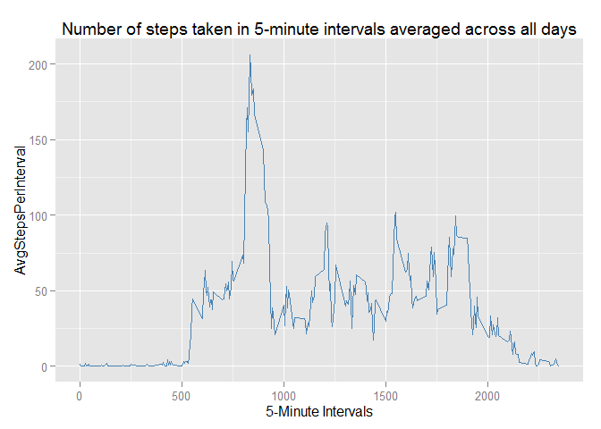

# Reproducible Research: Peer Assessment 1


## Loading and preprocessing the data

```r
# set the working directory and unzip the file
# setwd("RepData_PeerAssessment1")
# unzip("activity.zip")

# read in the file
data <- read.csv("activity.csv")
```


## What is mean total number of steps taken per day?

Note that for this analysis the missing values are ignored.

Here is the code to create a histogram showing the frequency of the total steps taken per day:


```r
# missing values are ignored!

# total number of steps taken each day goes into sumdata; 
# then plot the histogram (note we need to load ggplot2 library)

sumdata <- aggregate(list(StepsPerDay=data$steps),by=list(date=data$date), 
                     FUN=sum, na.rm=TRUE)

library(ggplot2)
```

```
## Warning: package 'ggplot2' was built under R version 3.2.1
```

```r
qplot(StepsPerDay,data=sumdata,geom="histogram",fill=I("steelblue"), 
            binwidth=1000) + 
            labs(title = "Histogram of the number of steps taken per day")
```

 

Next we calculate the mean and median of the total number of steps taken each day: 

```r
# calculate mean and median of the total number of steps taken each day

MeanStepsPerDay <- prettyNum(mean(sumdata$StepsPerDay,format="f",digits=1))
MedianStepsPerDay <- prettyNum(median(sumdata$StepsPerDay),format="d")
```
The mean number of steps per day is 9354.23; the median is 10395.


## What is the average daily activity pattern?
Here is the code to create and plot a time series showing the number of steps in each 5-minute interval averaged across all the days:


```r
# missing values are ignored!

# average number of steps in each interval across all days goes into 
#   intervaldata; plot the time series
intervaldata <- aggregate(list(AvgStepsPerInterval=data$steps),
                          by=list(interval=data$interval), FUN=mean, na.rm=TRUE)

qplot(interval,AvgStepsPerInterval,data=intervaldata,geom="line",
      color=I("steelblue")) + labs(title =
      "Number of steps taken in 5-minute intervals averaged across all days",
      x = "5-Minute Intervals")
```

 

Next we determine at what interval the maximum number is:

```r
IntervalWithMaxAvgSteps = intervaldata[which.max(intervaldata$AvgStepsPerInterval),
                                       "interval"]
```
The 5-minute interval at 835 has the maximum average number of steps.

## Imputing missing values

First we determine the number of missing values in the original data set:

```r
# calculate the number of missing values
dateNA<-sum(is.na(data$date))
intervalNA<-sum(is.na(data$interval))
NumOfMissingValues = sum(is.na(data$steps))
```
There are 0 missing dates, 0 missing intervals and 2304 missing steps in the dataset.

Then we impute the missing step values.  The strategy used to impute them is to take the mean across all days for the corresponding 5-minute interval, rounded to an integer value.

Here is the code to create a new data set with the missing values filled in, and a corresponding histogram showing the frequency of the total steps taken per day:

```r
# create new data set data2 with missing values replaced by imputed values, 
# using the mean for the matching 5-minute interval, rounded to an integer value

data2 <- data

for (i in 1:dim(data2)[1]) {
    if (is.na(data2$steps[i])) 
        data2$steps[i] <- 
            round(intervaldata$AvgStepsPerInterval[intervaldata$interval ==                                            data2$interval[i]])
}

# total number of steps taken each day (including imputed missing values) 
# goes into sumdata2; then plot the new histogram 

sumdata2 <- aggregate(list(StepsPerDay=data2$steps),by=list(date=data2$date), 
                     FUN=sum, na.rm=TRUE)
qplot(StepsPerDay,data=sumdata2,geom="histogram",fill=I("red"), 
            binwidth=1000) + labs(title = 
            "Histogram of the number of steps taken per day,\n missing values imputed")
```

 

Finally, we caluclate the corresponding mean and median:

```r
# calculate the new (missing values imputed) mean and median of the total number of steps # taken each day

MeanStepsPerDay2 <- prettyNum(mean(sumdata2$StepsPerDay,format="f",digits=1))
MedianStepsPerDay2 <- prettyNum(median(sumdata2$StepsPerDay),format="d")
```

The mean number of steps per day (with imputed missing values) is 10765.64; the median is 10762.  These are different than when the missing values were exluded from the data (9354.23 and 10395 respectively).  Imputing missing data increased the mean and median of the total daily number of steps.


## Are there differences in activity patterns between weekdays and weekends?

Here is the code to create and plot the time series (with the filled in missing values as created in the previous step) of the number of steps taken, averaged over weekend and weekdays:


```r
# create column "weekend" in data2 as a factor, indicating whether the corresponding
# date is a weekday or a weekend.
weekend_days <-c("Sunday","Saturday")
data2$weekend <- factor(weekdays(as.Date(data2$date)) %in% weekend_days,levels=c(FALSE,TRUE),labels=c("weekend","weekday"))

# average number of steps in each interval across the weekend/weekday factors 
# goes into intervaldata2 
intervaldata2 <- aggregate(list(AvgStepsPerInterval=data2$steps),
                          by=list(interval=data2$interval,weekend=data2$weekend), 
                          FUN=mean)

# plot the time series, one for weekday, one for weekend
qplot(interval,AvgStepsPerInterval,data=intervaldata2,geom="line",facets = weekend ~ .,
      color=I("red")) + labs(title =
      "Number of steps taken in 5-minute intervals \n averaged across weekend or weekdays",
      x = "Interval", y = "Average Number of Steps")
```

 
